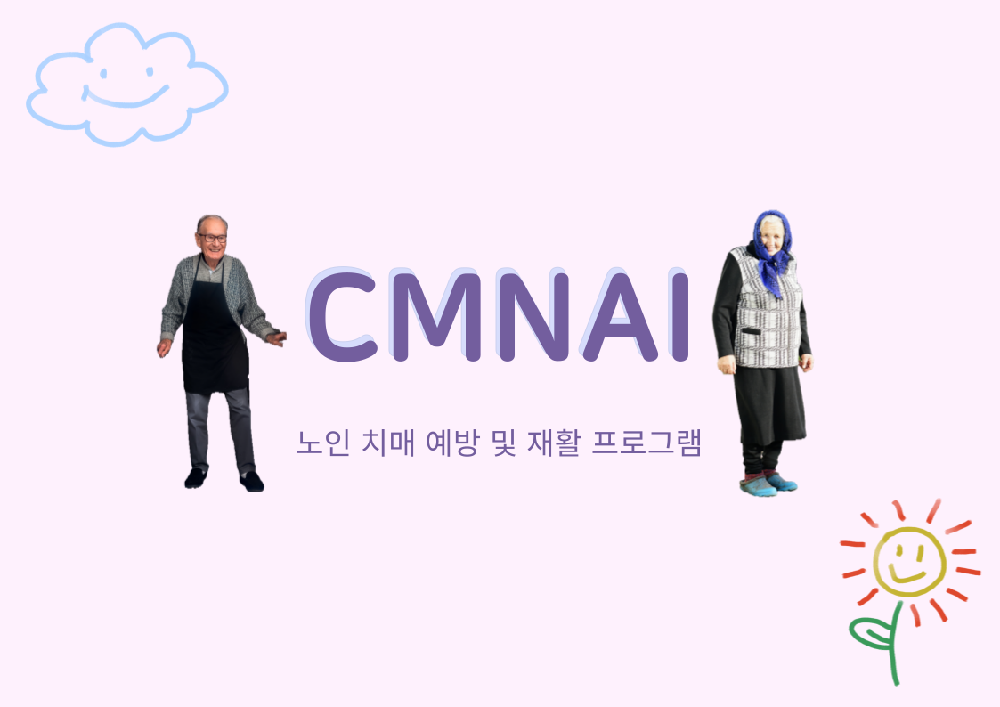

# CMNAI
## 노인 치매 예방 및 재활 프로그램

   
  
   

목차

## 프로젝트 소개

프로젝트 개요/동기

GIF Images

 

## 기술 스택

| Django | 
|:------:|
| ![dj]  |

 

## 구현 기능

### 기능 1

### 기능 2

### 기능 3

### 기능 4

 

## 배운 점 & 아쉬운 점

 

<!-- Stack Icon Refernces -->

[dj]: /images/django.png

### CMNAI : 현재 프로젝트 진행 폴더
### Process : 분업별 자료들
